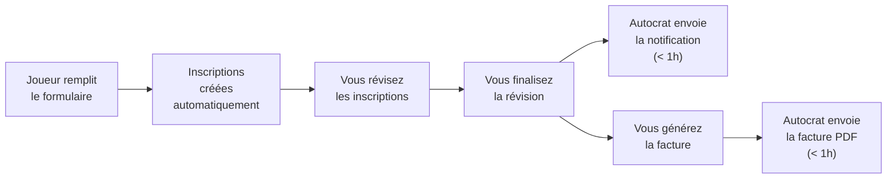

# Démarrage rapide

Le flux normal lorsqu'un joueur s'inscrit :

---

## Les 5 étapes

### 1. Le joueur s'inscrit

Le joueur remplit le formulaire Google. Le système crée automatiquement des lignes dans l'onglet **Inscriptions** (une ligne par programme choisi). Aucune action de votre part.

### 2. Vous révisez

1. Allez à l'onglet **Inscriptions**
2. Menu → **📋 Inscriptions → 📋 Réviser les inscriptions**
3. Cliquez sur chaque ligne et choisissez : ✅ Accepter, ⏳ Liste d'attente, ou ❌ Refuser

### 3. Vous finalisez

1. Une fois **tous** les programmes d'une soumission décidés
2. Menu → **📋 Inscriptions → 📨 Finaliser la révision**
3. → Un courriel est envoyé au joueur avec toutes les décisions

### 4. Vous générez la facture

1. Menu → **💰 Facturation → 📝 Générer la facture**
2. → La facture est créée et Autocrat l'envoie par courriel avec le PDF

### 5. Le joueur paie

1. Vous recevez le virement Interac
2. Dans l'onglet **Suivi de facturation**, changez le statut à `Payé`
3. → Autocrat envoie un accusé de réception
