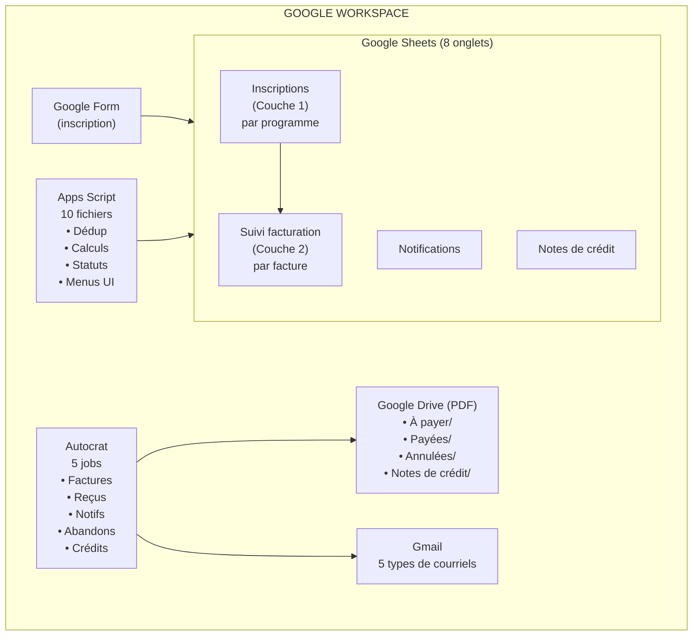
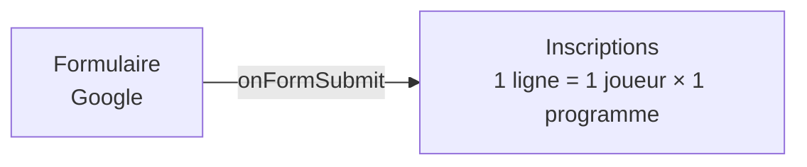
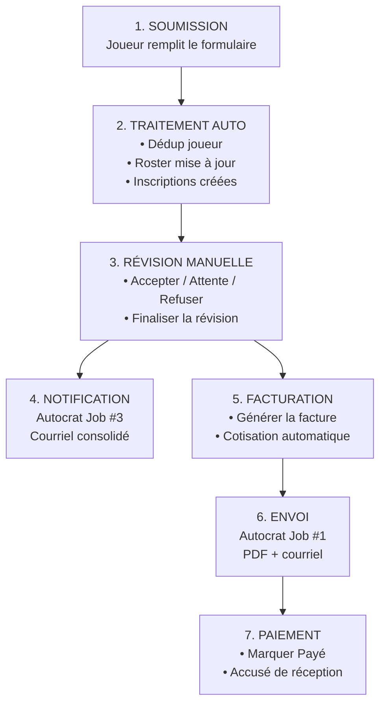
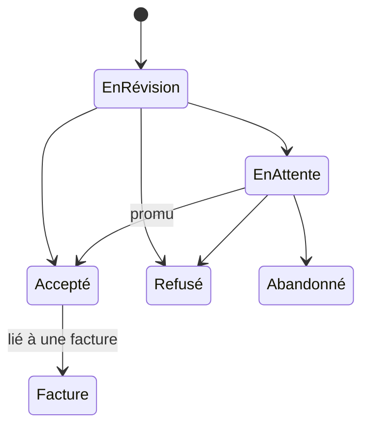
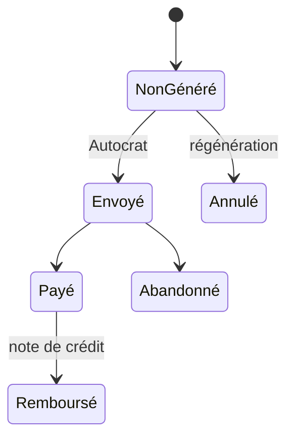

# Architecture V2.0

> Document technique décrivant l'architecture du système.

## Principe directeur : Configuration plutôt que Code

- Le **code** (Apps Script) gère la logique de données : déduplication, calculs, suivi
- La **configuration** (Autocrat + Google Docs) gère les courriels et documents PDF
- Un opérateur non technique peut modifier les textes des courriels et factures **sans toucher au code**

---

## Architecture hybride

---

## Modèle à deux couches

Le système sépare les **inscriptions** (décisions par programme) des **factures** (documents financiers).

### Couche 1 : Inscriptions

| Joueur | Programme | Statut |
|--------|-----------|--------|
| Jean | Adulte Jeudi | Accepté |
| Jean | Adulte Dimanche | En attente |
| Marie | Junior Dimanche | Accepté |
| Marie | Adulte Dimanche | Refusé |

- L'opérateur décide **par programme**, pas par soumission
- La notification est envoyée une seule fois par soumission (consolidée)

### Couche 2 : Factures

| No. Facture | Joueur(s) | Montant |
|-------------|-----------|---------|
| FACT-H2026-001 | Jean | $370 |
| FACT-H2026-002 | Marie + Luc | $780 *(facture familiale)* |

- Numéro de facture attribué au moment de la création (JIT)
- Jusqu'à 9 articles par facture

---

## Flux de données complet

---

## Fichiers source (10)

| Fichier | Lignes | Rôle |
|---------|--------|------|
| Config.js | ~490 | Constantes, colonnes, statuts, helpers |
| Inscriptions.js | ~390 | CRUD inscriptions, requêtes par statut/programme |
| FormHandler.js | ~200 | Déclencheur formulaire → crée les inscriptions |
| BillingTracker.js | ~590 | Factures, JIT, cotisation, abandon, waitlist flag |
| Notifications.js | ~220 | Notifications consolidées pour Autocrat |
| CreditNotes.js | ~140 | Notes de crédit (remboursements) |
| DriveOrganizer.js | ~200 | Organisation des PDF par sous-dossier |
| Menu.js | ~1250 | 19 actions de menu, dialogues, configuration |
| Pricing.js | ~170 | Correspondance programmes ↔ tarifs |
| Roster.js | ~190 | Répertoire des joueurs, dédup |

---

## Onglets du classeur (8)

| Onglet | Colonnes | Rôle |
|--------|----------|------|
| Réponses du formulaire | 21 | Données brutes (ne pas toucher) |
| Répertoire des joueurs | 21 | Fiche joueur, dédup par email |
| **Inscriptions** | 15 | 1 ligne par joueur × programme |
| **Suivi de facturation** | 48 | 1 ligne par facture (9 articles max) |
| Tarifs | 7 | Prix par programme par session |
| Configuration | 2 | Clés-valeurs de configuration |
| **Notifications** | 17 | Courriels consolidés (Autocrat #3) |
| **Notes de crédit** | 20 | Remboursements (Autocrat #5) |

Les onglets en **gras** sont nouveaux dans V2.0.

---

## Autocrat — 5 jobs

| # | Job | Source | Condition | Action |
|---|-----|--------|-----------|--------|
| 1 | Facture | Suivi facturation | Statut = `Non généré` | PDF + email |
| 2 | Accusé réception | Suivi facturation | Statut = `Payé` ET `Reçu envoyé = Non` | Email |
| 3 | Notification révision | Notifications | `Notification envoyée = Non` | Email |
| 4 | Avis abandon | Suivi facturation | Statut = `Abandonné` ET `Courriel abandon envoyé = Non` | Email |
| 5 | Note de crédit | Notes de crédit | `Envoyée = Non` | PDF + email |

Tous les jobs sont en mode **Time-based** (toutes les heures).

---

## Année de cotisation

La cotisation est un frais d'adhésion annuel (septembre à juin).

| Session | Année de cotisation |
|---------|---------------------|
| A2025 | 2025-2026 |
| H2026 | 2025-2026 |
| A2026 | 2026-2027 |
| H2027 | 2026-2027 |

Le système vérifie automatiquement si le joueur a déjà payé la cotisation pour l'année en cours.

---

## Diagramme des statuts

### Inscriptions

### Factures

---

## Limites du système

| Limite | Valeur | Impact |
|--------|--------|--------|
| Articles par facture | 9 | Max 3 membres × (2 prog. + cotisation) |
| Programmes sur le formulaire | 3 | Slots de notification = 3 |
| Articles par note de crédit | 3 | Suffisant pour les cas courants |
| Fréquence Autocrat | 1 heure | Délai max entre action et courriel |
| Joueurs par session | ~50 | Pas de limite technique |
